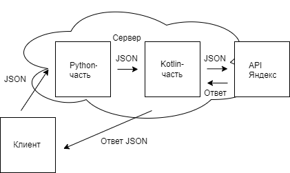

# Общая часть

Проект - Андроид-приложение, которое принимает на вход от пользователя голосовой ввод или текст. В этих входных данных содержится информация о том, куда хочет сходить либо съездить пользователь. В отличие от Яндекс.карт и других аналогов, формулировка пользователя данного приложения может не содержать четких мест (например, точный адрес пункта назначения), а просто пожелания пользователя в свободной форме. Например, "я хочу съездить на машине в парк, поездка должна составить не более одного часа, а затем заехать в кафе". Задача - построить маршрут на карте (Яндекс) по заданной неточной информации.

Приложение построено по клиент-серверной архитектуре. Все модели и алгоритмы располагаются удаленно на сервере, таким образом, приложение может быть запущено даже на не очень производительном устройстве. 

Структура следующая: введенная пользователем информация вместе с координатами местоположения и типом транспортного средства инкапсулируются в формат JSON. Этот JSON отправляется на удаленный сервер, где поступает на вход набору Python-скриптов. На выходе этих скриптов - еще один JSON, который поступает на вход Kotlin-скрипту. Он обращается к API Яндекс.Карт и формирует JSON, который содержит информацию о маршруте и отправляется пользователю. 

# Задачи коллег

Денис: Разработать приложение с доступным и понятным пользовательским интерфейсом, следуя принципам UX/UI. Обеспечить возможность как голосового, так и текстового ввода информации, а также выбора транспортного средства. Также возможность сохранять избранные маршруты, и вести историю маршрутов, и функциональность личного кабинета. Дизайн приложения - Figma, язык - Kotlin.

Дмитрий: Разработать Backend-алгоритм, обеспечивающий связь с API Карт и формирование маршрута по заданным параметрам. Язык - Kotlin. Необходимо обеспечить взаимодействие со скриптами на Python и с клиентом.

София: Настроить репозиторий, контролировать изменения в коде, вести документацию, администрировать таск-трекер и тайм-трекер, обеспечивать информационную поддержку разработки, взаимодействие с дизайнером.

Георгий: помимо разработки ML-части, провести deploy проекта на сервере, выложить файлы на удаленный сервер и обеспечить работу приложения.

# Мои задачи

Разработать backend-ML-Python алгоритм, который обрабатывает поступающий на вход запрос пользователя, выделяет из него ключевые слова, формирует JSON для передачи Kotlin-скрипту. Также сделать deploy бэк-части приложения на сервере.

**Более подробное описание:**

От клиента на вход поступает JSON-файл с тремя полями: координаты текущей точки местоположения, текст запроса, тип транспортного средства. Первые два поля являются обязательными, последнее - опционально (тип ТС может содержаться в тексте). В случае голосового ввода голос в текст преобразуется на клиенте локально. Пример - ниже

    {
    "tsys": "bike",
    "text": "хочу поехать на машине в кино потом на машине в кафе",
    "coords": "59.904775,30.310820"
    }

На выбор доступно 4 типа транспортных средств: велосипед (bike), автомобиль (car), автобус (bus), пешком (ped) - возможные значения поля с типом ТС. Текст представляет собой строку со словами на русском языке, разделенными пробелом (без знаков препинания и заглавных букв). Координаты местоположения - широта и долгота, строка, содержащая 2 числа типа float, разделенные символом ",". В приведенном выше запросе типы ТС в поле text и tsys разные - в таком случае приоритет отдается тексту.

Для хостинга выбран сервер Yandex Cloud по адресу 158.160.116.195. Написан файл server.py, который использует socket для обмена данными по сети. Этот файл получает на вход JSON, и извлекает из него данные - текст запроса, координаты текущей точки и тип ТС. В этом файле постоянно прослушивается 80-й порт - http. Если на вход поступает JSON, то он обрабатывается - текст сохраняется в отдельный файл request.txt, координаты и тип ТС присваиваются определенным переменным. Фрагмент файла представлен ниже.

    WORKING_DIR = os.getcwd()

    server = socket.socket()
    server.bind(('', 80))
    server.listen(1)

    while True:
        conn, addr = server.accept()
        request = conn.recv(10240).decode()
        matches = re.findall(r'{[^}]*}', request)
        data = json.loads(matches[0])

Далее информация поступает на вход файлам проекта. Они были выложены на удаленный сервер с помощью консольной утилиты scp. Это остальные файлы Python (кроме server.py), а также директории с ML-библиотеками rutermextract и pymorphy. 

После того, как появился файл request.txt, скрипт keyword_extraction.py извлекает ключевые слова из него и формирует файл keywords.txt. При извлечении ключевых слов используются библиотеки rutermextract и pymorphy. Первая непосредственно извлекает ключевые слова, а вторая приводит их заранее к начальной форме. Далее помечаются слова-разделители (если запрос составной), и отбрасываются все неключевые слова. Также выделяются слова, относящиеся ко времени поездки и типу ТС. Все остальные считаются ключевыми и помечаются припиской :place.
Для каждой части запроса в файлe keywords.txt отводится своя строка. Пример результата - ниже:

    парк:place велосипед
    кафе:place пешком

После того, как был сформирован файл keywords.txt, он поступает на вход скрипту make_json.py. Он подставляет нужные слова в нужные поля (формат представлен ниже), а также дополняет данные по умолчанию, если они не были указаны пользователем. Например, если не указан тип ТС, то считается, что пользователь идет пешком, или если не указано время, то оно подставляется как значение по умолчанию для выбранного ТС. Пример JSON - ниже

    {
        "id": "39148728-743f-44e8-8180-0f9b12218ee2",
        "entries": [
            {
                "entryno": 1,
                "tsys": "bike",
                "time": 30,
                "startpoint": "FROM_CLIENT",
                "destpoint": {
                    "name": "",
                    "category": "парк"
                }
            },
            {
                "entryno": 2,
                "tsys": "ped",
                "time": 30,
                "startpoint": "PREVIOUS_POINT",
                "destpoint": {
                    "name": "",
                    "category": "кафе"
                }
            }
        ]
    }

Далее сформированный JSON поступает на вход Kotlin-скрипту. На этом заканчивается моя часть работы в проекте.
