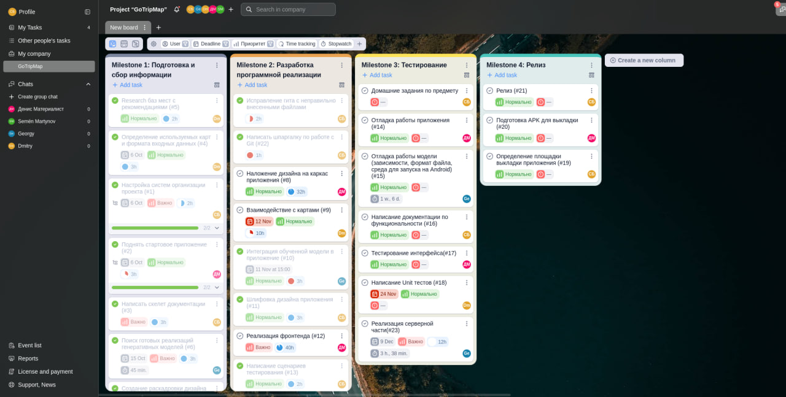

# Методология управления проекта

В качестве методологии управлениия в проекте был выбран достаточно гибкий подход Agile, так как у большой части участников команды
отсутствовал опыт разработки ПО в размах одного проекта несколькими людьми одновременно. Данная методология позволила избежать стресса внутри команды, за счет гибких процессов, позволяющих быстро синхронизировать команду, редактировать задачи и изменять дедлайны (особенно важно в рамках большой занятости команды учебой, а у некоторых, работой).

При данной методологии очень важен тандем руководителя и команды, что позволяет разработчикам не задумываться о бумажной волоките документации, так как работающий продукт важнее точной и подробной документации. 

Роль технического писателя в рамках данного проекта была отведена техническому лидеру.

Одним из недостатков данной методологии является отсутствие четкого плана и структуры работы, что было превнесено в данный проект из такой методологии как Waterfall.

# Task Tracker

В качестве тасктрекера был выбран отечественный продукт Yougile, реализованный в формате канбан доски и имеющий встроенный функционал таймтрекинга с автоматическим формированием отчетов.

С функциональностью данного тасктрекера можно ознакомится на их официальном [сайте](https://ru.yougile.com/). 

# План работ

## Milestone1 - Подготовка и сбор информации

5 рабочих дней

| Задача                                                   | Ответственный    |
|----------------------------------------------------------|------------------|
| Создание репозитория и системы ведения задач             | Бельская         |
| Сбор информации о возможных API взаимодействия с картами | Горяинов         |
| Сбор информации о моделях распознавания речи/текста      | Киселев          |
| Подготовка пустого андроид приложения                    | Здир             |
| Разработка дизайна приложения с дизайнером               | Бельская         |
| Подготовка скелета документации                          | Бельская         |

Результат данного этапа - собранное в apk и готовое к установке пустое андроид приложение,
определен инструмент для взаимодействия с картами, а также определена модель распознавания речи/текста,
Получена раскадровка внешнего видда приложения от дизайнера

## Milestone2 - Разработка программного реализации

20 рабочих дней

| Задача                                                                       | Ответственный       |
|------------------------------------------------------------------------------|---------------------|
| Обучение и подготовка модели к внедрению в приложение                        | Киселев             |
| Написание кода взаимодействия с картами                                      | Горяинов            |
| Созлание интерфеса приложения согласно раскадровке                           | Здир                |
| Написать сценарии тестирования приложения                                    | Бельская            |

Результат данного этапа - Андроид приложение, полностью содержащее в себе работающую функциональность,
а также с полностью реализованным дизайном, согласно раскадровке от дизайнера.

## Milestone3 - Тестирование

10 рабочих дней

| Задача                                                      | Ответственный   |
|-------------------------------------------------------------|-----------------|
| Написание функционального тестирования для проверки системы | Горяинов        |
| Ручное тестирование интерфейса приложения                   | Здир            |
| Написание документации по функциональности приложения       | Бельская        |
| Отладкка работы модели                                      | Киселев         |
| Отладка работы приложения                                   | Горяинов + Здир |

Результат данного этапа - 

## Milestone4 - Релиз

3 рабочих дня

| Задача                                     | Ответственный             |
|--------------------------------------------|---------------------------|
| Обсужденние места распотранения приложения | Вся команда               |
| Подготовка APK файла                       | Здир + Киселев + Горяинов |
| Выкладка APK файла                         | Бельская                  |
